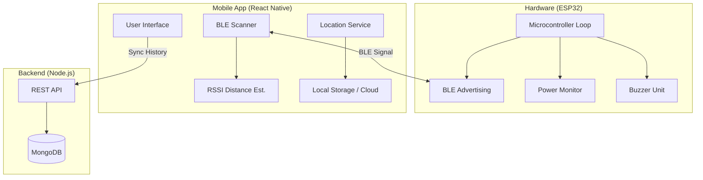

# Smart Charger Finder - System Architecture

## 1. High-Level Architecture
The system consists of three main components:
1.  **Smart Charger Device (Hardware)**: Broadcasts BLE signals, monitors power usage, and alerts via buzzer.
2.  **Mobile Application (iOS/Android)**: Scans for the charger, estimates distance (RSSI), and logs location.
3.  **Backend Server (Optional)**: Stores usage history and analytics.

## 2. Hardware Architecture
- **Microcontroller**: ESP32 (WROOM-32 recommended)
- **Power Supply**: 5V USB input (passthrough for charging phone + powering ESP32)
- **Output**: Piezo Buzzer (Active Low/High)
- **Sensors**: Current Sensor (ACS712 or similar) for "Charger Usage" detection (Simulated for this hackathon level if HW unavailable)

## 3. Data Flow
1.  **Lost Mode**:
    - User opens App -> Presses "Find Charger".
    - App scans for BLE Name `Smart_Charger_001`.
    - App shows RSSI signal bar.
    - User presses "Beep": App writes `0x01` to `BuzzerCharacteristic`.
    - ESP32 reads `0x01` -> Turns on Buzzer.

2.  **Last Seen Mode**:
    - App runs background tasks (if permitted) or checks on disconnect.
    - When BLE disconnects -> App gets current GPS location.
    - Saves `Reference{lat, long, timestamp}` to AsyncStorage.
    - Map displays pin at these coordinates.

## 4. Database Schema (Conceptual)
**User**
- `id`: UUID
- `username`: String
- `devices`: [ChargerID]

**ChargerHistory**
- `id`: UUID
- `charger_id`: String
- `event_type`: "CONNECTED" | "DISCONNECTED" | "BEEP"
- `location`: { lat, long }
- `timestamp`: Date
